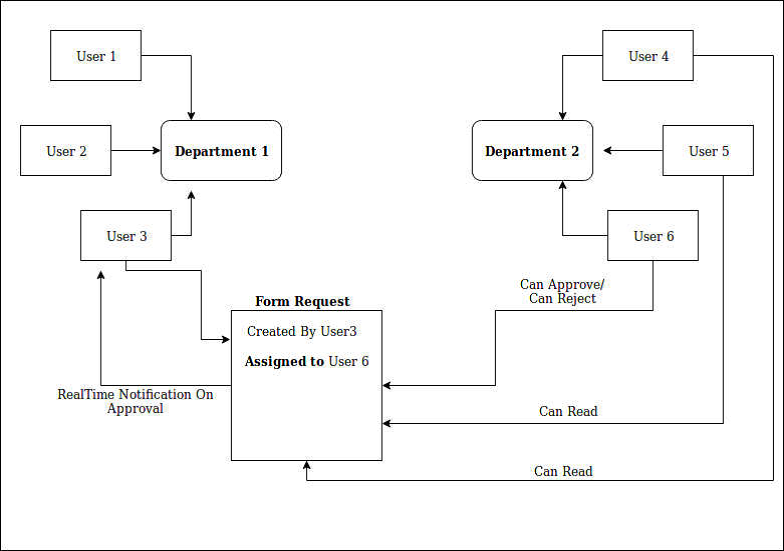

# OrgNetwork

## Features:

   ### Covered:
   - [x] Login option for users.
   - [x] A user belongs to a department, department can have as many users.
   - [x] A user can request a user of another department using a form.
   - [x] The form consists of Created by, Department(dropdown), Users (dropdown of users of
            respective department), Message field.
   - [x] A user cannot assign to the user of the same department.
   - [x] Routes in the frontend to see the past 5 pending request, approved request and
            rejected request (user specific).
   - [x] When a Request is assigned to the other department, all the users in the department (assigned
            dept.) can read the request, but only the assigned user has the permission to Approve or reject
            the Request.
   - [x] After Approval the Request shouldn't be shown to the users in assigned department.
   - [x] There should be a notification window which shows the notification rea- [ ]time (notification on
            form approval or rejection or new Approval request).
   - [x] Each and every Interactions here happens in rea- [ ]time (not RESTful way).
   - [x] Many more api's then the above features are available.
   - [x] Every work done using socket can also be done in RESTful way.
   
  
  ___
  
  ## Architecture used:
  
  
  
  
  ***
   
   #### Future Implementation for React:
   - [ ] Notification Route Panel.
   - [ ] Add internal switch Notification Badge.
